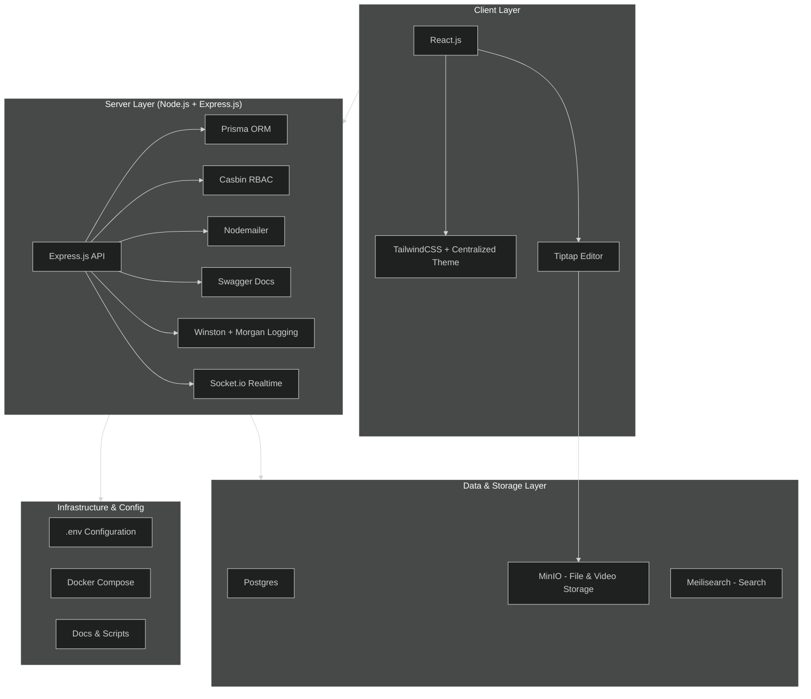

# 1. Agent Guidelines

These guidelines apply to **all contributors and agents** working on the project.  
Follow them strictly to maintain **quality**, **consistency**, **security**, and **scalability** across all environments.

TL;DR: The .env.local file is preconfigured with working public database, SMTP, and other settings, so you can run and test the project without extra setup. If you change any environment variables, update both .env.local (for your local tests) and .env.example (as a template for others). After making changes, atest with .env.local as and when required to ensure everything works and no errors occur.

---

## 2. Tech Stack Overview

| Technology              | Purpose                                                                                     |
|--------------------------|---------------------------------------------------------------------------------------------|
| Postgres                 | Primary relational database **hosted externally** (connected via `.env` connection string). |
| Express.js               | Server framework for REST APIs.                                                            |
| React.js (JavaScript)    | Client framework for the user interface — built entirely with JavaScript (no TypeScript).  |
| Vite                     | Lightweight build tool and dev server for fast frontend development (used instead of Next.js). |
| React Router DOM         | Client-side routing for single-page application (SPA) navigation.                          |
| Axios                    | HTTP client for communication between frontend and backend.                                |
| Node.js                  | Server runtime environment.                                                                |
| TailwindCSS + Theme      | Utility-first CSS framework with centralized, shared design system across all apps.        |
| Tiptap Editor            | Headless WYSIWYG editor with React integration and theme control. Extended with custom video support for **direct uploads to MinIO** (used for all media: video, images, docs). |
| Prisma ORM               | Schema and database management for Postgres.                                               |
| JWT                     | Authentication strategy (JWT tokens or sessions) to secure API routes and user sessions.    |
| Casbin (RBAC)            | Policy-based role and permission control integrated with Express.js.                       |
| dotenv                   | Environment variable management for configuration across frontend and backend.             |
| CORS Middleware          | Enables secure cross-origin communication between Vite frontend and Express backend.       |
| Nodemailer               | Server-side email sending.                                                                 |
| Winston + Morgan         | Structured JSON logging for server monitoring and debugging.                               |
| Swagger (OpenAPI)        | API documentation for all backend routes.                                                  |
| MinIO                    | **Externally hosted** object storage for **all file uploads including video**, using presigned URLs. |

---

## 3. Code and Project Structure

```
.
├── app/
│   ├── client/     # Client-side application (React)
│   ├── server/     # Server-side application (Express, Node)
│   ├── shared/     # Shared code (types, utils, constants, theme, editor config)
│   └── mobile/     # (Future - mobile app)
├── docs/           # Project documentation
├── docker-compose.yml   # Multi-service configuration
├── .env.example         # Centralized env template
├── infra/          # (Optional - Terraform, K8s, deployment scripts)
├── scripts/        # Utility scripts
└── README.md
```

**Structure Conventions**

- All apps live in `app/`.
- Product Requirement Documents (PRD) and its Features and User Stories lives in `docs/`.
- You **must have** Feature-based organization:
  ```
  client/src/features/<feature>
  server/src/modules/<feature>
  ```
- Shared integrations (`Nodemailer`, `MinIO`, `Casbin`) in `server/src/integrations`.
- Shared logic in `shared/`.
- Single `.env` for all services; template in `.env.example`.

---

## 4. Server Guidelines

- All APIs must be documented in **Swagger (OpenAPI)**.  
- Use **Winston + Morgan** for structured JSON logging.  
- Centralized error handling in:
  ```
  server/src/middlewares/errorHandler.js
  ```
- RBAC enforced via **Casbin middleware**.

---

## 5. Database and Models

- **Single source of truth:** Postgres.  
- **ORM:** Prisma.

**Schema location:**  
```
app/server/prisma/schema.prisma
```

**Migrations:**  
```bash
npm run prisma:migrate
```

- When `DEMO` variable in `.env` is set, seed demo data automatically.

---

## 6. Client Guidelines

- Use **TailwindCSS with centralized theme** (`app/shared/theme`). No local overrides allowed.  
- Routes must be defined only in `routes.js`.  
- Use **utility classes** and reusable components — no inline CSS.  
- **Tiptap** is the single WYSIWYG editor:  
  - Videos and other assets (PDFs, images, documents) are uploaded directly to **MinIO** using pre-signed URLs and embedded in content.

---

## 7. Environment and Configuration

- Centralized `.env` file at root.  
- `.env.example` is the **only** template reference.  
- All external services are connected using `.env` variables.
- No need to containerzie Minio and Posgress, as they are hosted externally.

---

## 8. Documentation and Communication

- All project-wide changes must be recorded in `CHANGELOG.md`. Include a **Date–Time Stamp (IST)** with every entry.
- All server APIs must be recorded in `API-SPECS.md`.
- All client Routes must be recorded in `ROUTES.md`.

---

## 9. Architecture


