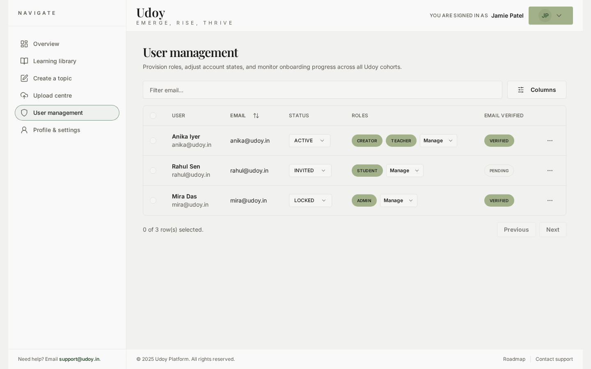
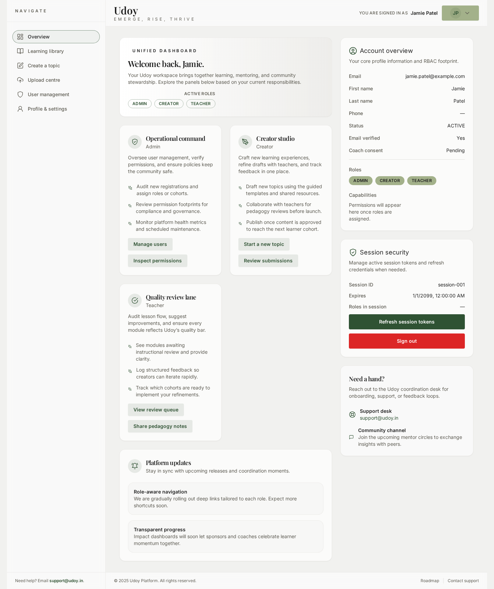
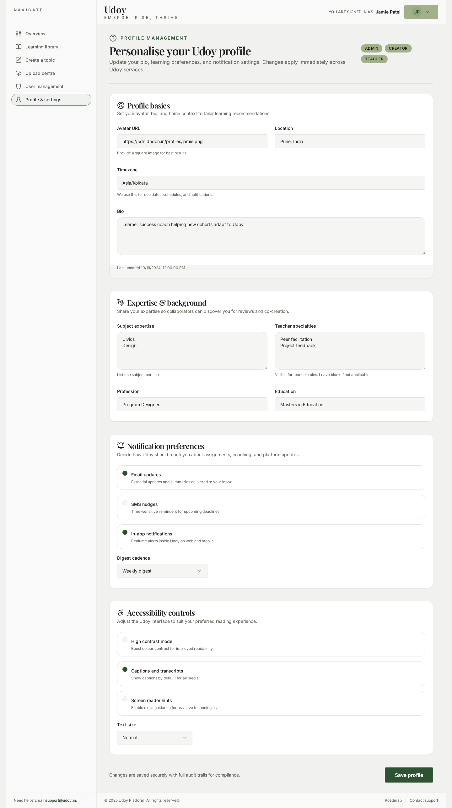
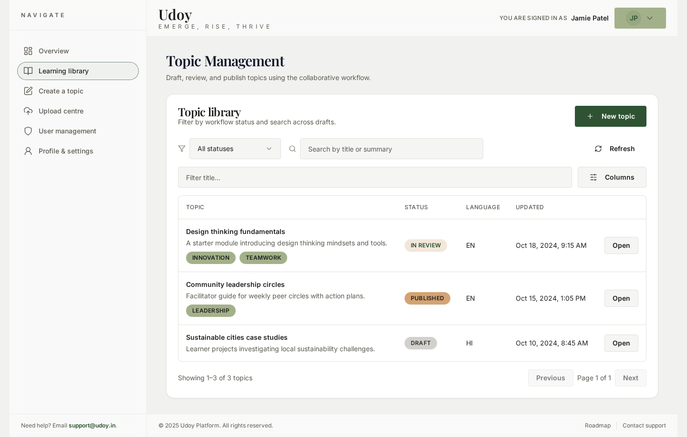
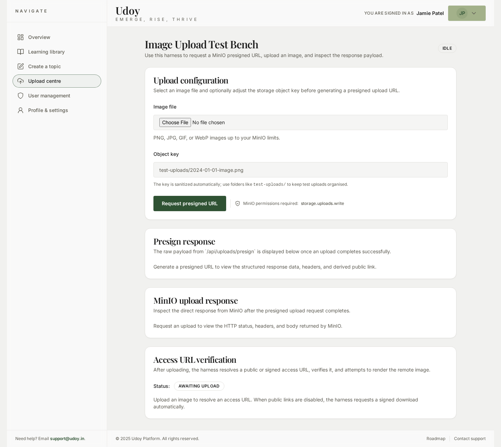

# Udoy Platform

A unified platform designed to help underrepresented students access mentors, future-ready learning, and transparent reward pathways. The Udoy landing page introduces the ecosystem's narrative while this repository houses the client, server, and shared packages that power it.

## Table of Contents
- [Vision and Narrative](#vision-and-narrative)
  - [Hero Promise](#hero-promise)
  - [Mission in Action](#mission-in-action)
  - [Ecosystem Roles](#ecosystem-roles)
  - [Engagement Paths](#engagement-paths)
  - [Frequently Asked Questions](#frequently-asked-questions)
- [Platform Overview](#platform-overview)
- [Screenshots](#screenshots)
- [Architecture](#architecture)
  - [Tech Stack](#tech-stack)
  - [Key Packages](#key-packages)
- [Getting Started](#getting-started)
  - [Prerequisites](#prerequisites)
  - [Environment Setup](#environment-setup)
  - [Running with Docker Compose](#running-with-docker-compose)
  - [Local Development without Docker](#local-development-without-docker)
- [Project Structure](#project-structure)
- [Scripts](#scripts)
- [Quality and Testing](#quality-and-testing)
- [Documentation Index](#documentation-index)
- [Community and Support](#community-and-support)

## Vision and Narrative
The landing experience presents Udoy as a launchpad where learners emerge, rise, and thrive through a virtuous cycle of learning, mentorship, and reinvestment.

### Hero Promise
- Introduces **Udoy** with the rallying cry **“Emerge, Rise, Thrive.”**
- Highlights a bold statement: *“Udoy is being built as the launchpad for children ready to rise above circumstance.”*
- Encourages immediate action with calls to **Join as a Sponsor**, **Become a Mentor**, or **Explore Learning Paths**, while surfacing trust signals like verified onboarding and transparent impact reporting.

### Mission in Action
- Frames the mission as *“Empowering students to not only catch up — but to outshine.”*
- Describes a collaborative network where alumni creators, teachers, coaches, and sponsors support each learner.
- Shares projected impact metrics (e.g., **92% targeted growth within six months**, **4.7/5 confidence ratings**, **100% transparent sponsorship tracking**) and social proof via partner testimonials.

### Ecosystem Roles
- Details five core personas — **Students, Creators, Teachers, Coaches, and Sponsors** — each with unique contributions to the learning flywheel.
- Emphasises why every role matters, reinforcing the collaborative nature of Udoy’s community.

### Engagement Paths
- Outlines clear activation routes such as sponsoring a cohort or volunteering to coach.
- Reinforces remote-first access, quarterly cohorts, and the compounding “Udoy Loop” that moves from learning to inspiration.

### Frequently Asked Questions
- Answers sponsor transparency concerns with a promise of a public impact ledger.
- Clarifies global participation for volunteers and the support structure for alumni creators.
- Describes student onboarding via community partnerships and personalised learning paths.

## Platform Overview
- **Client**: React + Vite SPA delivering the landing page, dashboards, and feature modules.
- **Server**: Express.js API with JWT auth, Casbin RBAC, Prisma ORM, and integrations for email, storage, and search.
- **Shared**: Cross-cutting theme tokens, UI primitives (shadcn + Tailwind), editor integrations, and utility modules.
- **Goal**: Sustain a transparent ecosystem that keeps students engaged, mentors supported, and sponsors informed.

## Screenshots






## Architecture
### Tech Stack
- **Frontend**: React, Vite, React Router DOM, TailwindCSS, shadcn/ui, Lucide Icons, TipTap.
- **Backend**: Node.js, Express.js, Prisma ORM, Postgres, Casbin, Socket.io, Nodemailer, Winston + Morgan logging.
- **Storage & Search**: MinIO for assets, Meilisearch for indexing, JWT-secured presigned uploads/downloads.
- **Tooling**: Docker, Docker Compose, dotenv-based configuration, centralized `.env` templates.

### Key Packages
- `app/client`: SPA with feature-based routing and shared design system.
- `app/server`: API services, integrations, Swagger docs, and background workflows.
- `app/shared`: Theme, icons, editor helpers, and other cross-application utilities.

## Getting Started
### Prerequisites
- [Node.js](https://nodejs.org/) **20.x** (for local development without Docker)
- [Docker](https://www.docker.com/) and [Docker Compose](https://docs.docker.com/compose/)

### Environment Setup
1. Copy the example environment file:
   ```bash
   cp .env.example .env
   ```
2. Update the secrets to match your local configuration as needed. The shared `.env` file is consumed by both the client and server.
3. Use `.env.local` for local overrides when testing; mirror any changes back to `.env.example`.

### Running with Docker Compose
Build and start both services:
```bash
docker compose up --build
```
Docker Compose will:
- Build the Express server image and expose it on port **6005**
- Build the Vite client image and expose it on port **6004**
- Inject the shared environment variables defined in `.env`

Stop the services with:
```bash
docker compose down
```

### Local Development without Docker
Each app can be started individually.

#### Server
```bash
cd app/server
npm install
npm run dev
```
The server listens on `http://localhost:6005`.

#### Client
```bash
cd app/client
npm install
npm run dev -- --host 0.0.0.0 --port 6004
```
The client listens on `http://localhost:6004` and proxies requests to the backend via `VITE_API_URL`.

## Project Structure
```
app/
  client/   # React (Vite) frontend
  server/   # Express backend
  shared/   # Shared theme, editor, icons, utilities
CHANGELOG.md
API-SPECS.md
ROUTES.md
README.md
```
Refer to feature folders under `app/client/src/features` and `app/server/src/modules` for domain-specific implementations.

## Scripts
Common commands are defined in each package:
- **Client** (`app/client/package.json`)
  - `npm run dev` – Launches the Vite dev server.
  - `npm run build` – Produces a production build.
  - `npm run preview` – Serves the production build locally.
  - `npm run test` – Executes Vitest suites.
- **Server** (`app/server/package.json`)
  - `npm run dev` – Starts the Express server with live reload.
  - `npm run build` – Compiles the server for production.
  - `npm run start` – Runs the compiled server.
  - `npm run prisma:migrate` – Applies Prisma migrations.

## Quality and Testing
- Health checks available at `http://localhost:6005/api/health` and surfaced via the client home dashboard.
- Vitest powers unit and component tests on the client; Node test harnesses cover server workflows.
- Linting and formatting follow the shared configuration defined in each package (run via `npm run lint` where available).

## Documentation Index
- [`CHANGELOG.md`](./CHANGELOG.md) – Time-stamped record of project-wide changes.
- [`API-SPECS.md`](./API-SPECS.md) – REST API documentation.
- [`ROUTES.md`](./ROUTES.md) – Client-side routing map.
- [`RBAC.md`](./RBAC.md) – Role-based access control policies.
- [`docs/`](./docs/) – Product requirements, feature briefs, and supporting references.

## Community and Support
- Interested in contributing? Review the shared theme tokens, component wrappers, and integration guidelines before raising PRs.
- For questions about the platform narrative or roadmap, align your messaging with the landing page story outlined above.
- For operational issues, raise GitHub issues referencing affected packages and attach logs or screenshots where relevant.
